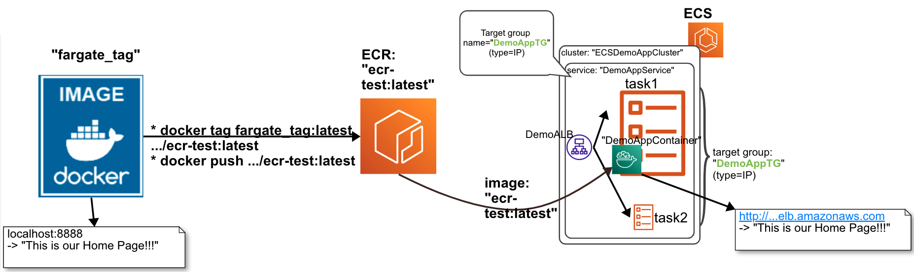
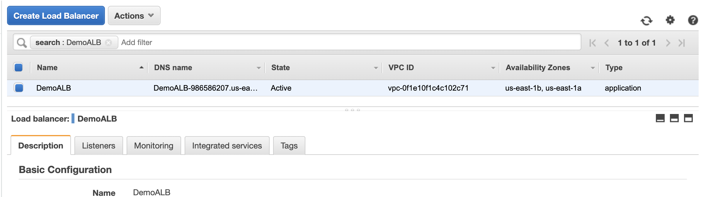
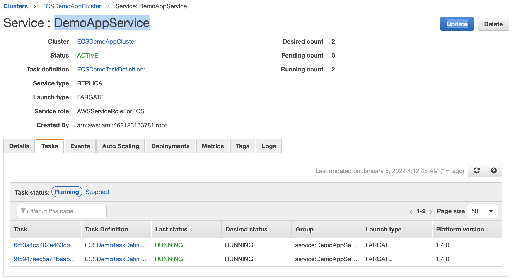
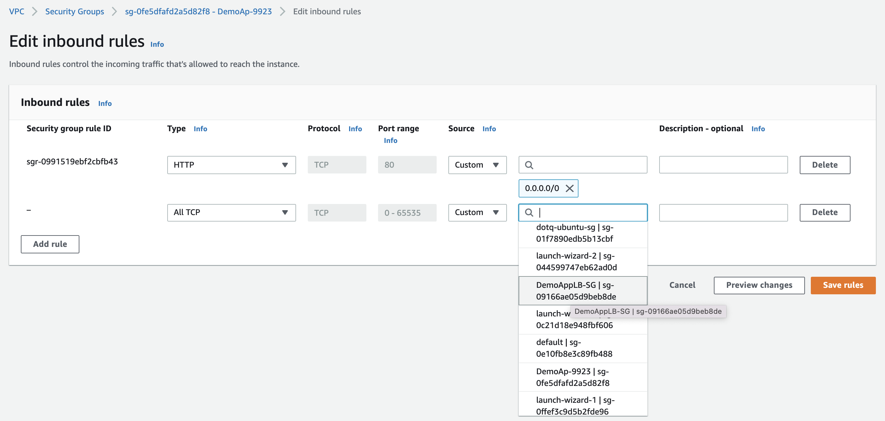
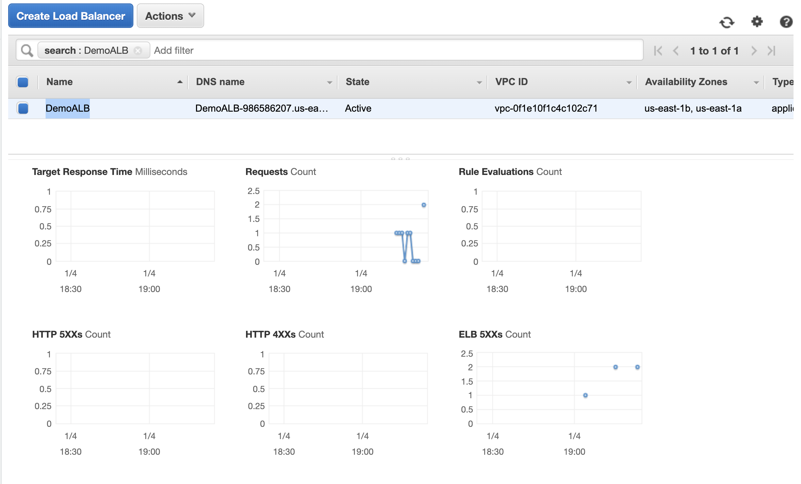

# aws-ecr-fargate-alb-api 🐳


[](https://github.com/tquangdo/aws-ecr-fargate-alb-api/issues/new)



## reference
[youtube](https://www.youtube.com/watch?v=o7s-eigrMAI&list=PL9nWRykSBSFihWbXBDX57EdpOmZxpUaVR&index=2)

## deploy local
```shell
docker build -t fargate_tag .
docker run -d --publish 8888:8081 fargate_tag
docker ps
CONTAINER ID   IMAGE         COMMAND           CREATED         STATUS         PORTS                                       NAMES
6a194105bf98   fargate_tag   "python app.py"   5 seconds ago   Up 5 seconds   0.0.0.0:8888->8081/tcp, :::8888->8081/tcp   silly_heyrovsky
```
+ access `localhost:8888` on browser will see `This is our Home Page!!!` (of `templates/index.html`)
+ access `localhost:8888/app` on browser will see `Hello, from App!`

## ecr
+ same with https://github.com/tquangdo/aws-ecr-ecs-flask-viewpics

## ecs
### create cluster:
+ template=`Fargate`
+ cluster name=`ECSDemoAppCluster`
### create task definition
+ launch type=`Fargate`
+ Task definition name=`ECSDemoTaskDefinition`
+ Task memory (MiB) = 2GB
+ Task CPU (unit) = 1 vCPU
#### add container
+ Container name=`DemoAppContainer`
+ Image=`ACCOUNTIDHERE!!!.dkr.ecr.us-east-1.amazonaws.com/ecr-test:latest`
+ Memory Limits (MiB) = 2048
+ Port mappings=`8081`
### create ALB
+ balancer types=`ALB`
+ balancer name=`DemoALB`
+ Network mapping=`us-east-1a`&`us-east-1b`
#### create SG
+ name=`DemoAppLB-SG`
+ inbound rule: TCP, 80, 0.0.0.0/0
#### create target group
+ type=`IP`
+ name=`DemoAppTG`
+ port=`8081`

+ final result: wait until state=`active`

### create service
+ type=`Fargate`
+ Service name=`DemoAppService`
+ Number of tasks=`2`
+ vpc=`default`
+ subnets=`1a` & `1b`
> + default SG=`DemoAp-9923`
+ Load balancer type=`ALB`
+ Load balancer name=`DemoALB`
+ Container to load balance=`Add to LB`
+ Production listener port=`80:HTTP`
+ Target group name=`DemoAppTG`
> if NOT see TG here, the reason is NOT chose "type=`IP`"
+ final result: status=`running`


## deploy container
### service's SG
+ ecs > service `DemoAppServiceUpdate` > click to SG `DemoAp-9923` 
+ add `Inbound rules`: All TCP + SG=`DemoAppLB-SG`

+ ALB `DemoALB` tab `Monitoring` will see "up line"

+ access `http://demoalb-986586207.us-east-1.elb.amazonaws.com/` (ALB's DNS) on browser will see `This is our Home Page!!!`
+ access `http://demoalb-986586207.us-east-1.elb.amazonaws.com/app` (ALB's DNS) on browser will see `Hello, from App!`
