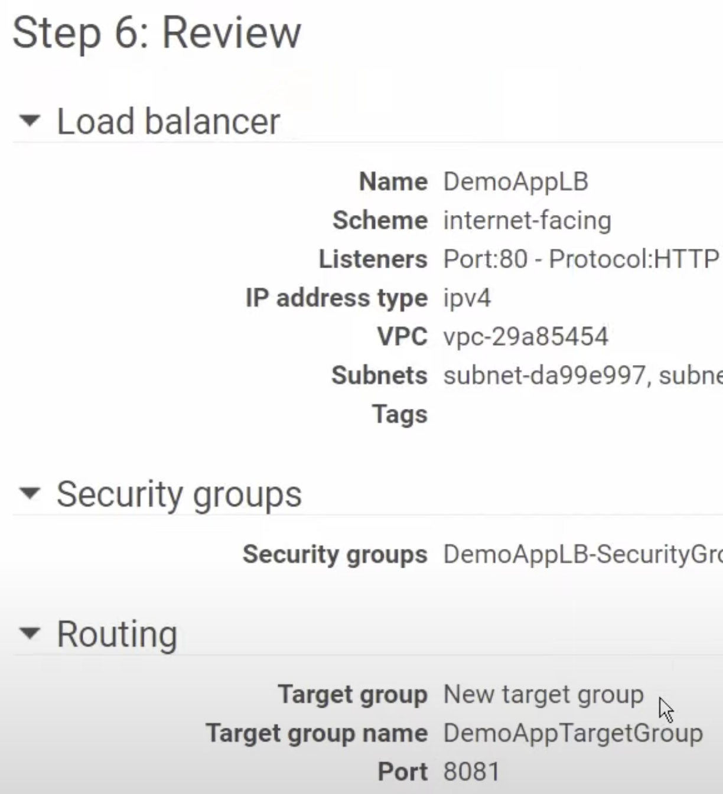
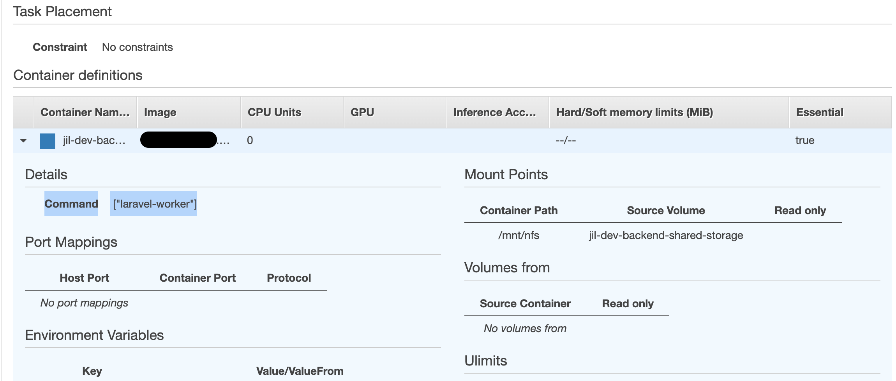
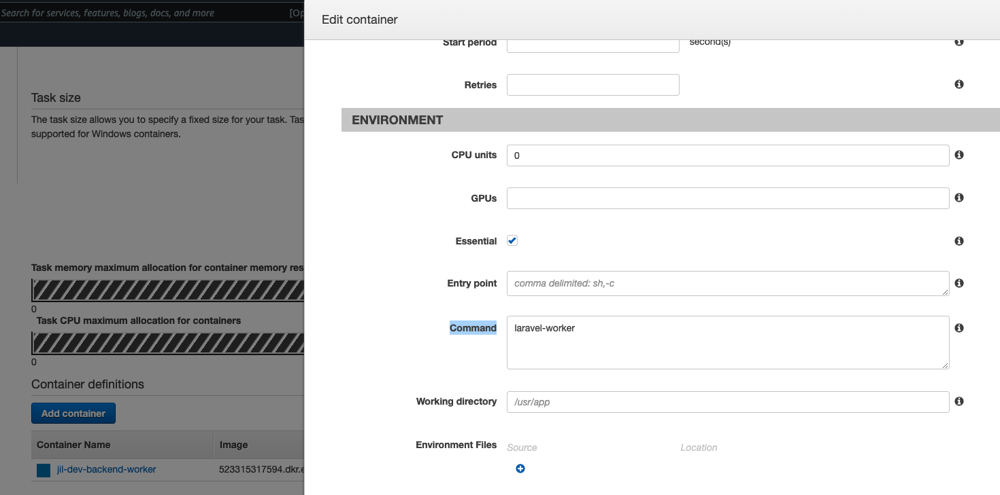

# aws-ecr-ecs-fargate-alb-api 🐳


[](https://github.com/tquangdo/aws-ecr-ecs-fargate-alb-api/issues/new)


## reference
[youtube](https://www.youtube.com/watch?v=o7s-eigrMAI&list=PL9nWRykSBSFihWbXBDX57EdpOmZxpUaVR&index=2)

## deploy local
```shell
docker build -t fargate_tag .
docker run -d --publish 8888:8081 fargate_tag
docker ps
CONTAINER ID   IMAGE         COMMAND           CREATED         STATUS         PORTS                                       NAMES
6a194105bf98   fargate_tag   "python app.py"   5 seconds ago   Up 5 seconds   0.0.0.0:8888->8081/tcp, :::8888->8081/tcp   silly_heyrovsky
```
+ access `localhost:8888` on browser will see `This is our Home Page!!!` (of `templates/index.html`)
+ access `localhost:8888/app` on browser will see `Hello, from App!`

## ecr
+ same with https://github.com/tquangdo/aws-ecr-ecs-flask-viewpics

## ecs
1. ### create cluster:
    + template=`Fargate`
    + cluster name=`ECSDemoAppCluster`
1. ### create task definition
    + launch type=`Fargate`
    + Task definition name=`ECSDemoTaskDefinition`
    + Task memory (MiB) = 2GB
    + Task CPU (unit) = 1 vCPU
    1. #### add container
        + Container name=`DemoAppContainer`
        + Image=`ACCOUNTIDHERE!!!.dkr.ecr.us-east-1.amazonaws.com/ecr-test:latest`
        + Memory Limits (MiB) = 2048
        + Port mappings=`8081`
1. ### create ALB
    + balancer types=`ALB`
    + balancer name=`DemoALB`
    + listener port=80
    > ⚠️⚠️IMPORTANT⚠️⚠️ different with TG's port=8081

    + Network mapping=`us-east-1a`&`us-east-1b`
    1. #### create SG
        + name=`DemoAppLB-SG`
        + inbound rule: TCP, 80, 0.0.0.0/0
    1. #### create target group
        + type=`IP`
        + name=`DemoAppTG`
        + port=`8081`
    1. #### final result:
        + wait until state=`active`
        
1. ### create service
    + type=`Fargate`
    + Service name=`DemoAppService`
    + Number of tasks=`2`
    + vpc=`default`
    + subnets=`1a` & `1b`
    > + default SG=`DemoAp-9923`
    + Load balancer type=`ALB`
    + Load balancer name=`DemoALB`
    + Container to load balance=`Add to LB`
    + Production listener port=`80:HTTP`
    + Target group name=`DemoAppTG`
    > if NOT see TG here, the reason is NOT chose "type=`IP`"
    + final result: status=`running`
    

## deploy container
1. ### service's SG
    + ecs > service `DemoAppServiceUpdate` > click to SG `DemoAp-9923` 
    + add `Inbound rules`: All TCP + SG=`DemoAppLB-SG`
    
1. ### result
    + ALB `DemoALB` tab `Monitoring` will see "up line"
    
    + access `http://demoalb-986586207.us-east-1.elb.amazonaws.com/` (ALB's DNS) on browser will see `This is our Home Page!!!`
    + access `http://demoalb-986586207.us-east-1.elb.amazonaws.com/app` (ALB's DNS) on browser will see `Hello, from App!`

## refer info
1. ### about folder `LaravelSampleCode`: xu li worker-redis-Laravel
    1. #### AWS Console
        - ECS service=`xxx-dev-backend-worker`
        - tab `Tasks` > click bat ki `Task definition` > muc `Container definitions` > click mui ten so xuong > call CMD "laravel-worker"
        
        ---
        
    1. #### src code
        - `LaravelSampleCode/xxx-backend/Dockerfile`
        ```shell
        ENTRYPOINT ["/usr/local/bin/docker-entrypoint.sh"]
        ```
        - `LaravelSampleCode/rootfs/usr/local/bin/docker-entrypoint.sh`
        ```shell
        "laravel-worker")
            exec /usr/bin/tini -- /usr/local/bin/php /usr/src/app/artisan queue:work"
        ```
1. ### tool check ecs exec
    1. #### reference
        - [github](https://github.com/aws-containers/amazon-ecs-exec-checker)
    1. #### run CMD
        - in case `aws_profile` is different from `default`
        ```shell
        export AWS_PROFILE=aws_profile
        export AWS_REGION=us-west-2
        TASK_ID=$(aws ecs list-tasks --cluster jil-stg-backend --service-name jil-stg-backend --output text --query 'taskArns[0]' --profile labor-stg)
        echo $TASK_ID
        => arn:aws:ecs:us-west-2:<AWS_ACCID!!!>:task/jil-stg-backend/<TASK_ID_SUFFIX!!!>
        bash <( curl -Ls https://raw.githubusercontent.com/aws-containers/amazon-ecs-exec-checker/main/check-ecs-exec.sh ) jil-stg-backend $TASK_ID
        =>
        -------------------------------------------------------------
        Prerequisites for check-ecs-exec.sh v0.7
        -------------------------------------------------------------
        jq      | OK (/usr/local/bin/jq)
        AWS CLI | OK (/usr/local/bin/aws)

        -------------------------------------------------------------
        Prerequisites for the AWS CLI to use ECS Exec
        -------------------------------------------------------------
        AWS CLI Version        | OK (aws-cli/2.2.15 Python/3.8.8 Darwin/21.2.0 exe/x86_64 prompt/off)
        Session Manager Plugin | OK (1.2.279.0)

        -------------------------------------------------------------
        Checks on ECS task and other resources
        -------------------------------------------------------------
        Region : us-west-2
        Cluster: jil-stg-backend
        Task   : arn:aws:ecs:us-west-2:<AWS_ACCID!!!>:task/jil-stg-backend/<TASK_ID_SUFFIX!!!>
        -------------------------------------------------------------
        Cluster Configuration  |
            KMS Key       : Not Configured
            Audit Logging : OVERRIDE
            S3 Bucket Name: Not Configured
            CW Log Group  : /ecs/jil-stg/backend/ecs_execute_command, Encryption Enabled: false
        Can I ExecuteCommand?  | arn:aws:iam::<AWS_ACCID!!!>:user/Jil-Stg-Ecs-Exec-User

        An error occurred (AccessDenied) when calling the SimulatePrincipalPolicy operation: User: arn:aws:iam::<AWS_ACCID!!!>:user/Jil-Stg-Ecs-Exec-User is not authorized to perform: iam:SimulatePrincipalPolicy on resource: arn:aws:iam::<AWS_ACCID!!!>:user/Jil-Stg-Ecs-Exec-User
        ```
